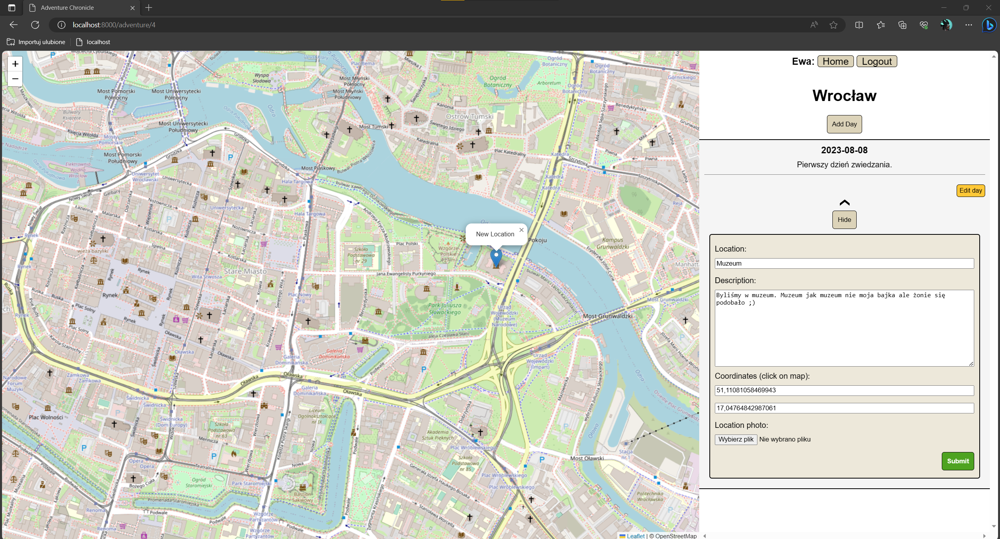
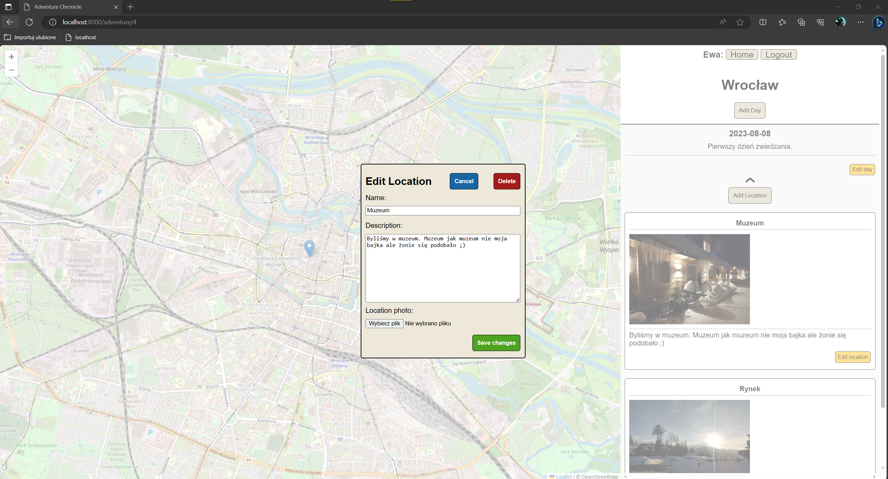

# Adventure Chronicle
#### Video Demo: TODO
### Presentation






## Description:
Web application, written in django framework for keeping track of our adventures/journeys. Every adventure contains days and each day can contains many locations/routes. All locations can be displayed on map through usage of leaflet library.

## Requirements
* [django](https://www.djangoproject.com/) - core framework.
* [pillow](https://pypi.org/project/Pillow/) - uploading images

## To Do:
* allow to change coordinates of existing markers
* shearing adventures with other users
* testing - unit testing for models 
* testing - client site (selenium)
* display on mobile devices

## How to run

Install all requirements and in main application folder run command:

        python3 manage.py makemigrations
        python3 manage.py migrate
        python3 manage.py runserver

## File Overview

### Python files
```
/adventure
```
* **views.py** - contains all end points and forms. 
* **urls.py** - urls management   
* **models.py** - contains database models 

### HTML templates:
```
/adventure/templates/adventure
```
### JavaScript and CSS:
```
/adventure/static/adventure
```
* **index.js** - main page, creating new adventure
* **map.js** - manage all action connected with map (Leaflet)
* **adventure.js** - adventure page, creating new days and location 